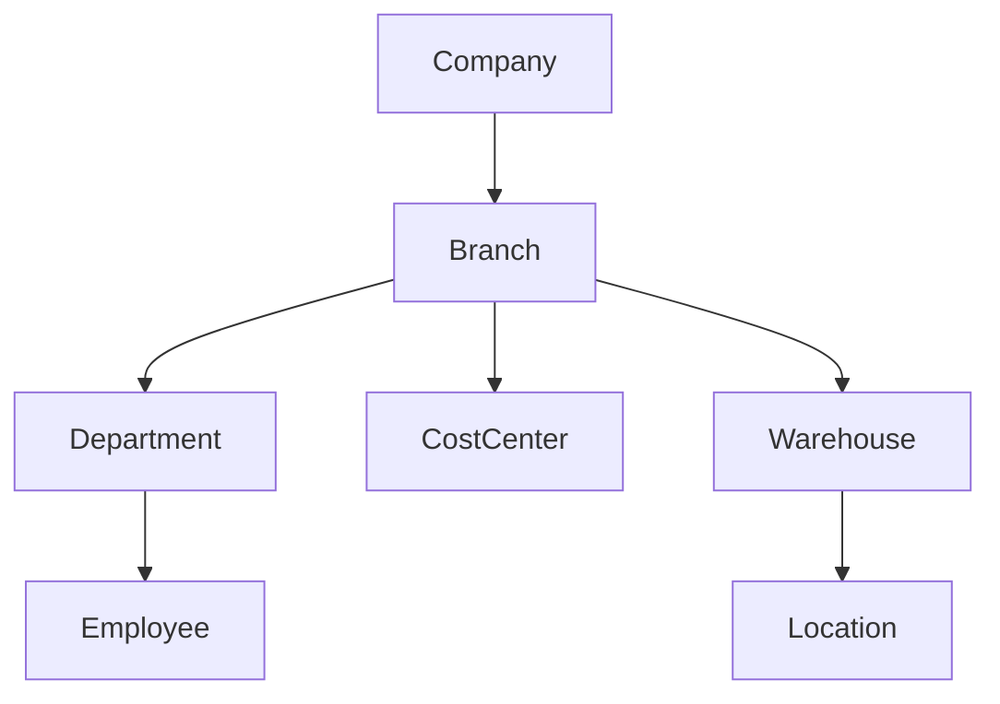
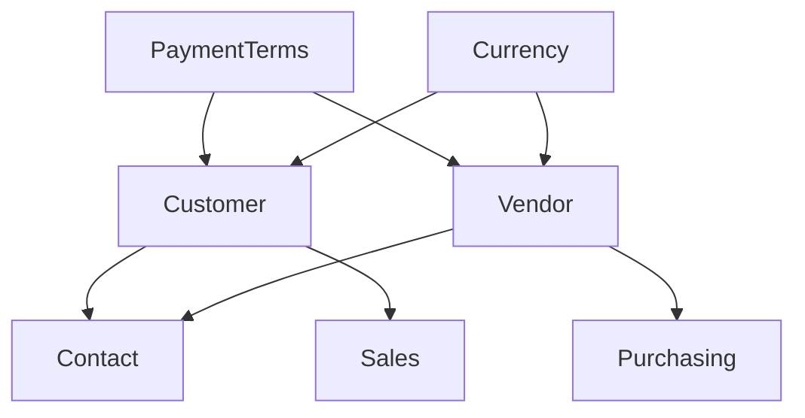
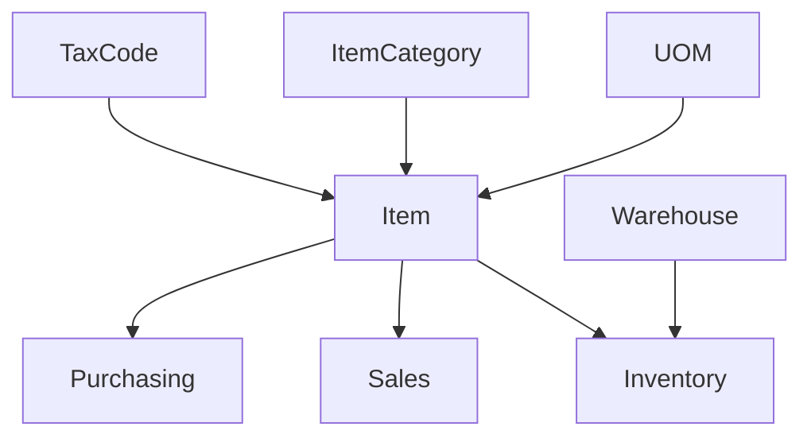
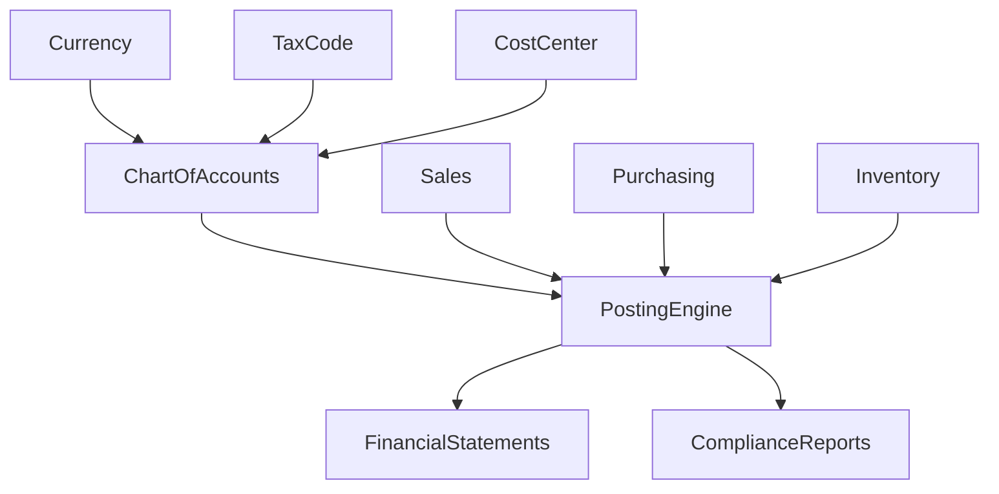

# Module Dependency Map

**Date:** June 26, 2026

## Objective
This document maps the architectural dependencies across the entire PXL ERP system. Understanding these relationships is critical to prevent circular dependencies and to ensure that foundational data exists before dependent records are created.

## Core Hierarchy

## External Parties

## Inventory & Items

## Financials & Compliance

## Full System Overview

- **Company** is the root node of the entire ERP.
- **Branch** is the primary operational hub.
- **Chart of Accounts** and **Tax Codes** are the ultimate downstream receivers of all transactional data.
- **Posting Engine** serves as the central clearinghouse bridging operational modules (Sales, Purchasing, Inventory) to the General Ledger.
